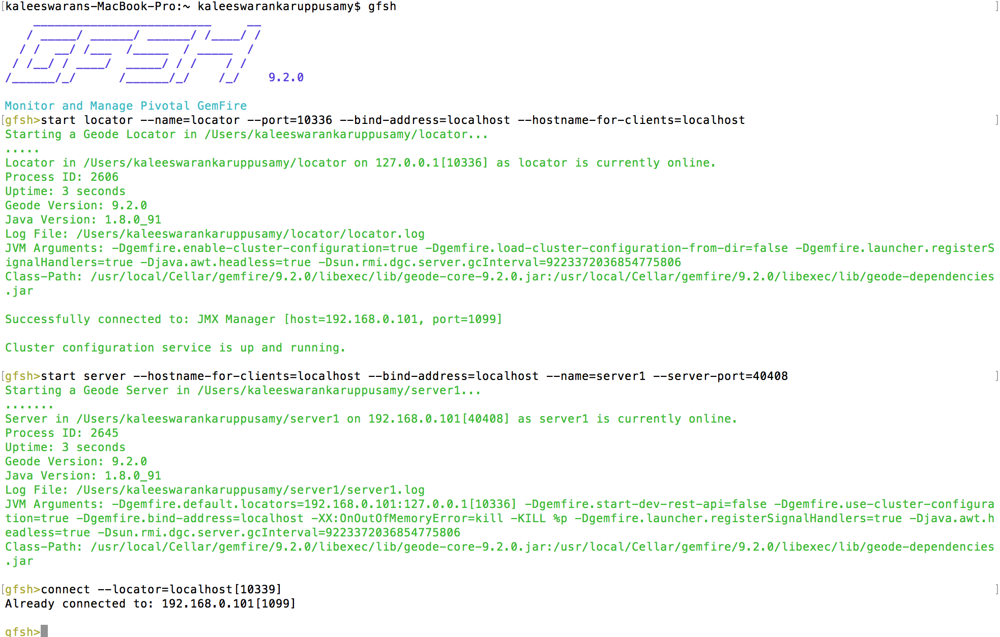

# Apache Geode - Grafana Dashboard

Utility tools for analysing and visualising [Apache Geode](http://geode.apache.org/) `historical` and `real-time` 
metrics with [Grafana](https://grafana.net/). Two sub-projects aim to provide real-time ([jmx-to-grafana](./jmx-to-grafana)) 
and historical ([statistics-to-grafana](./statistics-to-grafana)) metrics monitoring.

## Architecture
As illustrated on the diagram below, the `Geode Grafana` toolset provides unified technical stack for visualizing 
and analysing both `Real-Time` (e.g JMX metrics) and `Historical` (archive files) cluster statistics. 

###### Geode JMX Metrics Analysis
Geode implements federated `JMX` architecture to manage and monitor all members of the distributed system. 
The [jmx-to-grafana](./jmx-to-grafana) spring-boot application consumes selected Geode MBean metrics and streams them 
into a InfluxDB time-series database. Grafana uses the time-series to build comprehensive dashboards to monitor and 
analyze the distributed system.

###### Geode Statistics Analysis
Geode collects [detailed statistics](http://geode.apache.org/docs/guide/managing/statistics/chapter_overview.html) 
about the distributed system. This statistics is persisted in local archive files by each cluster member. 
Use the [statistics-to-grafana](./statistics-to-grafana) tool to convert the archive files into InfluxDB time-series database. 
Use Grafana to build comprehensive dashboards from the statistics time-series. 

## Installation Steps

#### Start gemfire Server

#### Install Time-Serious DB InfluxDB

Follow below link to install InfluxDB

https://docs.influxdata.com/influxdb/v0.9/introduction/installation/

>brew update
>brew install influxdb

##### To have launchd start influxdb now and restart at login:

  >brew services start influxdb
  
##### Or, if you don't want/need a background service you can just run:

  >influxd -config /usr/local/etc/influxdb.conf
  
##### Connect influx DB

 > influx
 > create database GeodeJmx
 > show databases
  name: databases
  name
  ----
  _internal
  GeodeJmx
  
#### Install Grafna

http://docs.grafana.org/installation/

>brew update
>brew install grafana

To have launchd start grafana now and restart at login:
  brew services start grafana
Or, if you don't want/need a background service you can just run:
  grafana-server --config=/usr/local/etc/grafana/grafana.ini --homepath /usr/local/share/grafana cfg:default.paths.logs=/usr/local/var/log/grafana cfg:default.paths.data=/usr/local/var/lib/grafana cfg:default.paths.plugins=/usr/local/var/lib/grafana/plugins

>brew services start grafana

go to browser and type bleow URL after starting grafna service

http://localhost:3000/

credential = admin/admin

#### Configure Grafna and start jmx-to-grafna service
Follow this steps to configure and start jmx-to-grafna
https://github.com/kaleeswaran393/gemfire-monitoring/tree/master/jmx-to-grafana

#### Configure Grafna and start statitics-to-grafna service
Follow this steps to configure and start statitic-to-grafna

https://github.com/kaleeswaran393/gemfire-monitoring/tree/master/statistics-to-grafana

## Toolset
#### [Geode JMX To Grafana](./jmx-to-grafana) 
[</img>](https://www.youtube.com/watch?v=e2UlWm1w2yY)
Geode distributed system real-time metrics visualization with Grafana dashboard. 
Geode uses a federated `Open MBean`  to manage and monitor all members of the distributed system. Single MBeanServer 
aggregates 
MBeans from local and remote members and provides a consolidated, single-agent view of the 
distributed system.	`jmx-to-grafana` is a generic, JMX compliant client that feeds the JMX metrics
to InfluxDB database. Grafana consumes the feeds and provides graphical dashboards for monitoring vital, real-time 
health and performance of Geode clusters, members, and regions.
Internally `jmx-to-grafana` communicates with a Geode JMX manager to provide a complete view of 
your Geode deployment. 
The [Geode JMX Grafana Video](https://www.youtube.com/watch?v=e2UlWm1w2yY) illustrates the approach. It shows how to 
deploy and start the `jmx-to-grafana` 
and how to build Grafana dashboards using the geode jmx feed.

#### [Geode Statistics To Grafana](./statistics-to-grafana) 
Leverage Grafana (metric & analytic dashboards tool) for querying, visualizing and analysing 
[Apache Geode & Gemfire Statistics Archives](http://geode.apache.org/docs/guide/managing/statistics/chapter_overview.html). 
Geode can collect statistics about the distributed system and persist it in archive files. The `statistics-to-grafana` 
tool loads later into a Grafana supported time-series database such as InfluxDB. Then one can 
build comprehensive Grafana dashboards to visualize and analyse the statistics data.

#### [Geode Grafana Dashboards](./jmx-to-grafana/src/main/resources/dashboards)
Repository of pre-build Grafana dashboards that can be used as templates to create customized dashboards.
There are `Cluster`, `Members` and `Regions` views on the Geode distributed system. 
